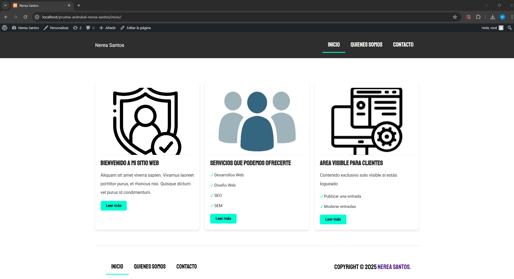

# Prueba Asdrubal

Este es el proyecto realizado como parte de la prueba para el proceso de selección de SEO Junior en Asdrubal SEO.
Aquí se muestra el tema personalizado creado para WordPress.

## Vista previa del proyecto

## Descripción

Este proyecto consiste en un tema de WordPress personalizado que incluye varias funcionalidades y estilos aplicados según las especificaciones dadas. 
La plantilla es completamente funcional y diseñada para ser responsiva, asegurando una excelente experiencia de usuario en diferentes dispositivos.

## Tecnologías utilizadas
- WordPress
- PHP
- HTML5
- CSS3
- JavaScript

¡Gracias por revisar mi proyecto!
